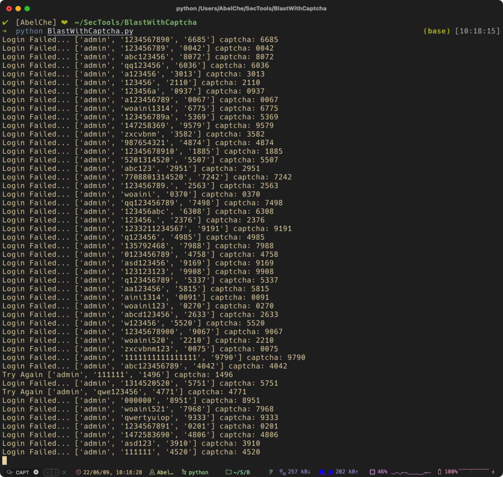
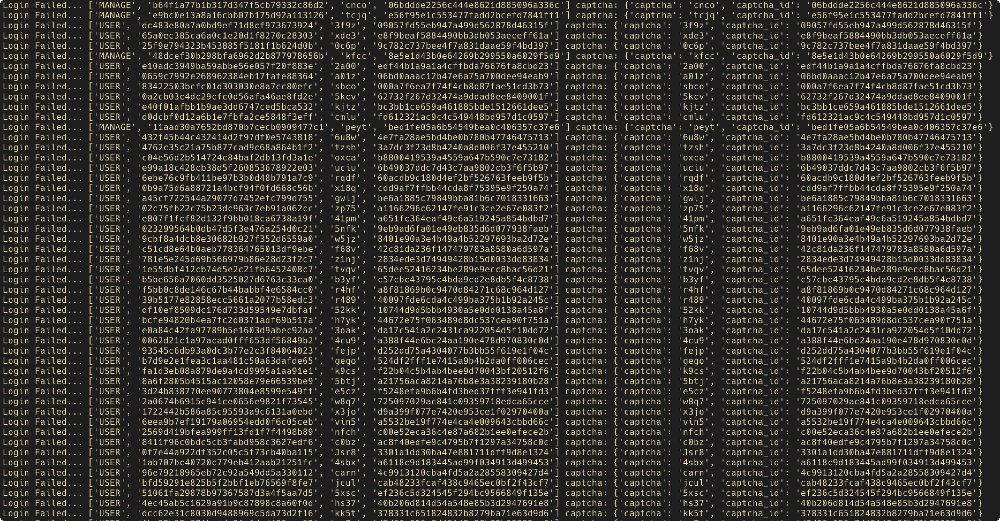

# BlastWithCaptcha

[](https://www.oscs1024.com/project/AbelChe/BlastWithCaptcha?ref=badge_large)

爆破带有验证码认证的请求

- 本地ocr [ddddocr](https://github.com/sml2h3/ddddocr)
- 多线程
- 支持payload自定义二次处理（插件）2022.06.10更新
- 支持用id检查验证码的类型 2022.06.13更新

## 使用方法

### 初始

1. 拉取和配置环境

```shell
git clone https://github.com/AbelChe/BlastWithCaptcha.git
cd BlastWithCaptcha

pip install -r requirements.txt -i https://pypi.tuna.tsinghua.edu.cn/simple
```


2. 请求文件

以账号密码登录认证为例

- blast.txt

从burpsuite等工具中复制登录的请求包到blast.txt

在get或post参数中标记需要爆破的参数位置，如下所示，爆破username password 以及验证码 validCode

使用`$<index>$`标记，注意这里需要按照index的顺序设置config.yaml字典列表的顺序

设置字典列表时，验证码位置忽略顺延即可

这里1 2 3位置的对应关系：1、2对应config.yml的`target.WORDDICT_LIST`，3对应`target.CAPTCHA_INDEX`

```
POST /api/login HTTP/1.1
Host: example.com.test
Cookie: SESSION=xxxxxxxxxxxxxxxxxxxxxxxxxxxxxxxxxxxxxxx
Content-Length: 61
Sec-Ch-Ua: " Not A;Brand";v="99", "Chromium";v="102", "Microsoft Edge";v="102"
Accept: application/json, text/plain, */*
Content-Type: application/json;charset=UTF-8
Sec-Ch-Ua-Mobile: ?0
User-Agent: Mozilla/5.0 (Macintosh; Intel Mac OS X 10_15_7) AppleWebKit/537.36 (KHTML, like Gecko) Chrome/102.0.5005.63 Safari/537.36
Sec-Ch-Ua-Platform: "macOS"
Origin: https://example.com.test
Sec-Fetch-Site: same-origin
Sec-Fetch-Mode: cors
Sec-Fetch-Dest: empty
Referer: https://example.com.test/
Accept-Encoding: gzip, deflate
Accept-Language: zh-CN,zh;q=0.9,en;q=0.8,en-GB;q=0.7,en-US;q=0.6
Connection: close

{"username":"$<1>$","password":"$<2>$","validCode":"$<3>$"}
```

- captcha.txt

直接复制burpsuite中请求验证码的数据包即可

```
GET /captcha.jpg HTTP/1.1
Host: example.com.test
Cookie: SESSION=xxxxxxxxxxxxxxxxxxxxxxxxxxxxxxxxxxxxx
Sec-Ch-Ua: " Not A;Brand";v="99", "Chromium";v="102", "Microsoft Edge";v="102"
Sec-Ch-Ua-Mobile: ?0
User-Agent: Mozilla/5.0 (Macintosh; Intel Mac OS X 10_15_7) AppleWebKit/537.36 (KHTML, like Gecko) Chrome/102.0.5005.63 Safari/537.36
Sec-Ch-Ua-Platform: "macOS"
Accept: image/webp,image/apng,image/svg+xml,image/*,*/*;q=0.8
Sec-Fetch-Site: same-origin
Sec-Fetch-Mode: no-cors
Sec-Fetch-Dest: image
Referer: https://example.com.test/
Accept-Encoding: gzip, deflate
Accept-Language: zh-CN,zh;q=0.9,en;q=0.8,en-GB;q=0.7,en-US;q=0.6
Connection: close


```

另外，**无需**考虑`blast.txt`和`captcha.txt`的cookie对应关系，程序会自动生成新回话


3. 配置

配置文件`config.yml`

```yaml
system:
  PROXY: # 上行代理 例如 127.0.0.1:8080
  REQUEST_RETRIES: 5 # requests 的重试
  ONCETIME_THREAD_POOL_SIZE: 1 # 并发数
  THREAD_POOL_SIZE: 10 # 线程池最大线程数
  TRYAGAIN_TIMES: 3 # 验证码识别失败重试次数
  USERAGENT: Mozilla/5.0 (Macintosh; Intel Mac OS X 10_15_7) AppleWebKit/537.36 (KHTML, like Gecko) Chrome/101.0.4951.64 Safari/537.36 #自定义user-agent
  LFLAG: '$<' # 左标志符号
  RFLAG: '>$' # 右标志符号
  SSL_VERIFY: FALSE # requests verify配置，默认即可

ocr:
  CAPTCHA_REGEX: '.*(\w{4})' # 对ocr识别的结果进行提取 例如 .*(\w{4}) .*(\d{4}) (.*?) ......
  CAPTCHA_REGEX_GETVALUE_INDEX: 1 # 搭配CAPTCHA_REGEX使用，获取其正则表达式结果位置，从1开始

target:
  BLAST: blast.txt # 爆破的请求文本文件，默认即可
  CAPTCHA: captcha.txt # 验证码请求文本文件，默认即可
  CAPTCHA_LENGTH: 4 # 验证码位数，用于鉴别ocr识别结果准确与否 例如4 6...... 设置为0的话则为不验证验证码位数
  CAPTCHA_DATATYPE: CUSTOM # 验证码返回数据类型，可选择 原始图片:RAW base64编码:BASE64 自定义获取数据:CUSTOM
  CAPTCHA_CUSTOM_GETFLAG: 'code"\:"(.*?)"' # 搭配CAPTCHA_DATATYPE值为CUSTOM使用，正则表达式提取数据
  CAPTCHA_ID_INDEX: 4 # 验证码id位置，标志位从1开始
  CAPTCHA_ID_GETFLAG: '"codeId"\:"(.*?)"' # 提取验证码id的正则表达式
  CAPTCHA_INDEX: 3 # 验证码的位置，标志位从1开始
  WORDDICT_LIST: # 字典设置，需要注意顺序与BLAST文件中标记的顺序对应
    - 
      file: /Users/AbelChe/SecTools/worddicts/fuzzDicts/userNameDict/top500.txt # 字典文件位置
      plugin: # payload插件配置 数组格式 留空即为使用字典原始数据
        - ['upper']
    - 
      file: /Users/AbelChe/SecTools/worddicts/Blasting_dictionary/top100password.txt # 字典文件位置
      plugin: # payload插件配置 数组格式
        - ['md5'] # 格式为[插件名称（与plugins目录下文件名称对应）, 参数1, 参数2, ......] 参数要与插件代码中的args=[]对应, 映射关系为 args=[参数1, 参数2, ......]
        - ['suffix', 'xxxxxxxxxx']
  SSL: False # 使用https与否
  CAPTCHA_ERROR_FLAG: # 判断验证码错误的文本标志，正则表达式
    - 验证码错误
    - 请输入正确验证码
    - 验证码异常
  CAPTCHA_ERROR_CODE: # 判断验证码错误的状态码
    - 500
    - 502
    - 403
  LOGIN_ERROR_FLAG: # 判断认证失败的标志，正则表达式
    - 账号不存在或密码错误
  LOGIN_ERROR_CODE: # 判断认证失败的状态码
  LOGIN_SUCCESS_FLAG: # 判断登录成功的文本标志，正则表达式
    - 登录成功
  LOGIN_SUCCESS_CODE: # 判断登录成功的状态码


```

关于插件：

类似burp爆破的payload processing，可以自定义，使用方法见上方`target.WORDDICT_LIST`的解释，插件目录为`plugins/`

自定义插件:

如下代码为添加前缀（如果你写过sqlmap tamper插件，那你也应该会写这个）：

```python
class PayloadProcessor: # 类名称不要更改
    name = __name__ # 不用修改
    description = '添加前缀' # 插件描述
    def __init__(self, payload, args=[]): # 不用修改
        self.payload = payload # 不用修改
        self.args = args # 不用修改 从config.yml的target.WORDDICT_LIST[1].get('plugin')[1]传进来的, 故这里args值为['XXXXXX']

    def __str__(self): # 不用修改
        return self.name # 不用修改

    def genterPatload(self): # 不用修改
        #>>>>>>>>>>>>自定义代码段>>>>>>>>>>>>>
        try:
            # return 返回payload字符串即可
            return self.args[0] + self.payload
        except Exception as e:
            print(e)
        #<<<<<<<<<<<<自定义代码段<<<<<<<<<<<<<
```


4. 启动

需要python>=3.7

```shell
python BlastWithCaptcha.py
```


5. 结果

如果有爆破成功的，会保存到`BlastWithCaptchaResult.txt`中

### 类型1 session验证验证码

#### 配置

参考[使用方法-初始](#初始)

#### 效果



### 类型2 带有id的验证码

#### 配置

以如下数据包为例：

- captcha.txt

```
POST /captcha HTTP/1.1
Host: example.test.com
Content-Length: 2
User-Agent: Mozilla/5.0 (Macintosh; Intel Mac OS X 10_15_7) AppleWebKit/537.36 (KHTML, like Gecko) Chrome/102.0.5005.63 Safari/537.36
Content-Type: application/json
Accept: */*
Origin: http://example.test.com
Referer: http://example.test.com/
Accept-Encoding: gzip, deflate
Accept-Language: zh-CN,zh;q=0.9,en;q=0.8,en-GB;q=0.7,en-US;q=0.6
Connection: close

{}
```

返回内容：

```
HTTP/1.1 200 
Server: nginx/1.21.4
Date: Mon, 13 Jun 2022 03:38:54 GMT
Content-Type: application/json
Connection: close
Vary: Origin
Vary: Access-Control-Request-Method
Vary: Access-Control-Request-Headers
Access-Control-Allow-Origin: *
Set-Cookie: JSESSIONID=XXXXXXXXXXXXXXXXXXXXXXXXX; Path=/; HttpOnly
Content-Length: 1186

{"code":200,"msg":"成功","data":{"codeId":"20ebd4da6fbf43e5a12c0ffdfb04049c","code":"iVBORw0KGgoAAAANSUhEUgAAAMgAAABkCAIAAABM5OhcAAAC/UlEQVR42u3csW1UQRAGYHdD4giJjCZIEQ3QgGNESAuERAROCKjBBSACeqACEiydZCEffre3t/M8s/tJf7zS3n2adzs7967uftxMkxfXL5/KTNsskSuwBCywwAILLLAELLDA2kXMziEGLLDAAgsssAQssMACCyywRB8LCLDAAmuffLj90xiwwBqG6ThggTXSE1hgRZECC6woVWCBFaIKLLBCVIEFVk8roWUpsFaHNcSTBilY58FarfN+/e5tdJaAFaQKLLBCVIEFFlhggQVWCVhxqsACCyywwAILrJlgaZCCBRZYYIFVCNbrN6+2AxZYIz01CgMLrE5P27zAAmuAqmNeYC0NayCpR7bA2nXOONVocoSqB1tgLQorTtUhYK0I65LjHlhghTSoGtcBay1Yo1SdXA2s7LA2bA2HNXBBsArDOtfWcFUby4KVvY91d+qlkkNgDT9gglUeVqOtIFVPLQ5WAVhDbIEFVg+sbWEbqoKa+GDNBuu/iYZ1bCvz6DpYY2xtHwafHVYhZHPC6rZVCFZyYdPC6rN1UlVCWDl5zQyrg1ddWNl4zQ+rnVfLczA5rDy2loD1+9fHf9MHa+d5rOq8VqlYGQb6uke7KtoCqwCsbmRggXXerVF+W2CVhNXOCyyweu6509oCqzastLbACp8a3SFggfU8tsACa5KiBdYksLIVLbDAAoutOrbAAgsssMCaEpamwyqwvn75dB9FC6yQijWWV+miBdb4R+GB1+XCwAIrSlhdW2DF/nj/+f3bfbp5RcwggDXPqfDA6yCsiq0LlwVr13bDg7CI8azhJ4Y57qHX6mOdyytuOm9jfXeFVRuk7QUsYv4zrgSClaXz3iIs/2iyeay8VzqpeJkgnfCuMIMtM+9rwdqN1wSqwMrFK6JWgVUJ1kBel3zx/gk9J6whDdVuBF4KsgqssVXnEk9ggXUT8da1Fd+PJTvAyrAvsGaDlWRfYE0FK8++wJoEVrZ9gVWeV84dgVXSWf4tgCVgSV1Y7z/fbsTnJY35C6jt8+lW0RYQAAAAAElFTkSuQmCC"}}
```

- blast.txt

```
POST /login HTTP/1.1
Host: example.test.com
Content-Length: 114
User-Agent: Mozilla/5.0 (Macintosh; Intel Mac OS X 10_15_7) AppleWebKit/537.36 (KHTML, like Gecko) Chrome/102.0.5005.63 Safari/537.36
Content-Type: application/json
Accept: */*
Origin: http://example.test.com
Referer: http://example.test.com/
Accept-Encoding: gzip, deflate
Accept-Language: zh-CN,zh;q=0.9,en;q=0.8,en-GB;q=0.7,en-US;q=0.6
Connection: close

{"user":"$<1>$","passwd":"$<2>$","code":"$<3>$","codeId":"$<4>$"}
```

- config.yml

`config.yml`对应部分如下

```yaml
target:
  CAPTCHA_LENGTH: 4 # 验证码位数
  CAPTCHA_DATATYPE: CUSTOM # 验证码返回数据类型，可选择 原始图片:RAW base64编码:BASE64 自定义获取数据:CUSTOM
  CAPTCHA_CUSTOM_GETFLAG: 'code"\:"(.*?)"' # 提取验证码base64内容
  CAPTCHA_ID_INDEX: 4 # 验证码id位置，$<4>$
  CAPTCHA_ID_GETFLAG: '"codeId"\:"(.*?)"' # 提取验证码id的正则表达式
  CAPTCHA_INDEX: 3 # 验证码的位置，$<3>$
```

#### 效果




## TODO

- [x] 插件（类似burp爆破的payload processing）2022.06.10
- [x] 带有id的验证码 2022.06.13
- [ ] GUI

## 使用的项目

- [https://github.com/sml2h3/ddddocr](https://github.com/sml2h3/ddddocr)
- https://github.com/psf/requests
- https://github.com/requests/toolbelt